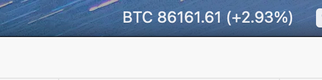
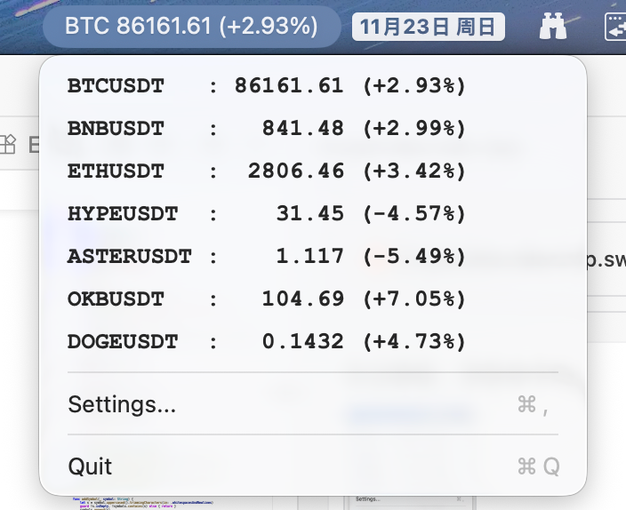

# Crypto Menu Bar / 加密货币菜单栏助手

A simple, native macOS Menu Bar application that displays real-time cryptocurrency prices.
一个简单、原生的 macOS 菜单栏应用程序，用于显示实时加密货币价格。



## Features / 功能特性

- **Real-time Prices**: Fetches prices from CoinMarketCap API every 10 seconds.
  **实时价格**：每 10 秒从 CoinMarketCap API 获取一次价格。

- **Customizable**: Add or remove any trading pair (e.g., BTCUSDT, ETHUSDT).
  **可定制**：添加或删除任何交易对（例如 BTCUSDT、ETHUSDT）。

- **Menu Bar Ticker**: Displays the selected symbol directly on the menu bar.
  **菜单栏行情**：直接在菜单栏上显示选定的币种。

- **Dropdown List**: Click to see prices and 24h change for all configured symbols.
  **下拉列表**：点击查看所有配置币种的价格和 24 小时涨跌幅。

- **Native Experience**: Built with Swift and SwiftUI, featuring a clean, aligned UI with bold fonts.
  **原生体验**：使用 Swift 和 SwiftUI 构建，具有整洁、对齐的 UI 和清晰的粗体字体。



## How to Run / 如何运行

1. Open Terminal in this directory.
   在此目录下打开终端。

2. Run the build script:
   运行构建脚本：
   ```bash
   ./build_app.sh
   ```

3. Open the app:
   打开应用程序：
   ```bash
   open CryptoMenuBar.app
   ```

## Configuration / 配置

1. **API Key**: You need a CoinMarketCap API Key.
   **API 密钥**：您需要一个 CoinMarketCap API 密钥。

2. **Settings**: Click the menu bar icon -> "Settings..." to enter your key and manage coins.
   **设置**：点击菜单栏图标 -> "Settings..." 输入您的密钥并管理币种。

## Default Symbols / 默认币种

- BTCUSDT
- BNBUSDT
- ETHUSDT
- HYPEUSDT
- ASTERUSDT
- OKBUSDT
